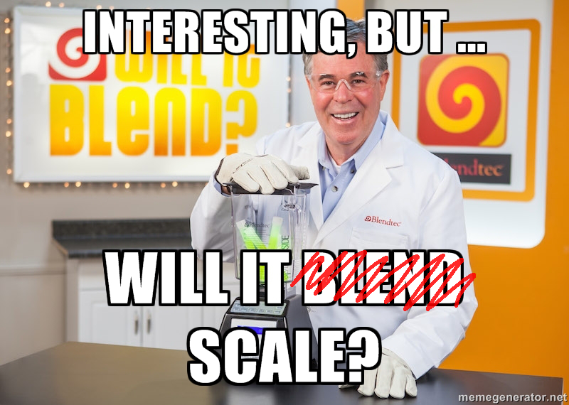
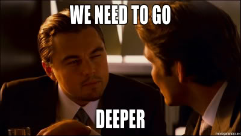

- title : Build Yourself A Google
- description : How to find stuff quickly in a big pile of text
- author : Daniel Bradley
- theme : serif
- transition : default

***

## Build Yourself A Google

' Aim: remove some magic

***

## A brief history of finding stuff on the internet

---

### 1995 - AltaVista

- First full-text search service for the internet.
- Information was gathered by crawlers.
- Ran on 20 machines, each had:
  - 130MB of RAM
  - 500GB of storage
- *10 terrabytes total storage!*

' norm: 1 GB HDD, 8mb RAM

---

### 1997 - Ask Jeeves

Introduced popularity ranking

---

### 1998 - Google
> **PC Magazine** reports that Google *"has an uncanny knack for returning extremely relevant results"*

' Page rank: ranking by factors such as number of links from other pages.

---

### Google's growth
*Pages Indexed:*

2008: 1,000,000,000,000

Today: > 30,000,000,000,000

' Still got 87 zeros to add until they reach a googol

---

## Differentiators:
Ranking

## Commonalities:
Find information quickly and efficiently

---

Let's focus on commonalities that make search possible

All this material revolves around the Apache Lucene library.

***

<small>revised title</small>

## 'How to find stuff quickly in a big pile of text'

---

## What's the problem?
Doesn't `ctrl`+`F` work pretty well?

---

---

## What if we ...

#### Double the text in each document?
#### Double number of documents?
#### Double number of users?

---

***

## What's the alternative?

*We need to 'invert the index'*

' Indexes: find information quickly
' Inverted index: lets see ...

---

### 3 documents with 1 sentence in each

    [lang=js]
    var documents = {
      "docA": "it is what it is",
      "docB": "what is it",
      "docC": "it is a banana"
    };

' Reality might be files in folder
' This is index of documents

---

### List the words in each document

    [lang=js]
    var documents = {
      "docA": "it is what it is",
      "docB": "what is it",
      "docC": "it is a banana"
    };

    var wordsInDocuments = {
      "docA": ["it", "is", "what", "it", "is"],
      "docB": ["what", "is", "it"],
      "docC": ["it", "is", "a", "banana"]
    };

' Tokenisation

---

### Invert the lookup

    [lang=js]
    var wordsInDocuments = {
      "docA": ["it", "is", "what", "it", "is"],
      "docB": ["what", "is", "it"],
      "docC": ["it", "is", "a", "banana"]
    };

    var documentsWithWords = {
      "a": ["docC"],
      "banana": ["docC"],
      "is": ["docA", "docB", "docC"],
      "it": ["docA", "docB", "docC"],
      "what": ["docA", "docB"]
    };

' Change doc to words -> word to docs

***

### Querying

    [lang=js]
    var index = {
      "a": ["docC"],
      "banana": ["docC"],
      "is": ["docA", "docB", "docC"],
      "it": ["docA", "docB", "docC"],
      "what": ["docA", "docB"]
    };

Which documents match the following searches:

1. "banana"
2. "a AND what"
3. "what OR banana"
4. "it AND NOT what"

' Use whiteboard
' Boolean operators

***

### Now we've finished the intro...

' In the real world, there's a bit more to it than just words

***

## <s>Tolkienisation</s>

## Tokenisation

' Turning a single big blob of text
' into lots of small blobs

---

## How do we extract words?

### Start simple

Split on whitespace

`spaces`, `tabs` & `new lines`

---

## What about punctuation?

*"He finally answered (after taking five minutes to think) that he didn't understand the question."*

' Brackets, full-stop, apostrophe.
' Algorithm gets a little more tricky.

---

### What about other languages?

*"구미의 남서쪽에 있는 금오산도립공원은 영남 팔경의 하나이다."*

*"不过，影评人对电影的剧情褒贬不一，他们的批评认为，可以预见到电影不会对其所提出的问题加以解决。"*

' UNICODE TEXT SEGMENTATION (35 pages)
' Don't do it yourself
' Lucene StandardTokenizer
' Grammar-based tokeniser per-language
' http://unicode.org/reports/tr29/

---

### Special cases

e.g. Path hierarchy

`"/home/foo/bar"`

⇩

 `["/home/foo/bar", "/home/foo", "/home", "/"]`

' Email addresses
' URLs

***

## Analysis (transformation)

`Tokenisation` ⇨ `Analysis` ⇨ `Indexing`

' Taking the small blobs and changing them

---

## Casing

`SomeThing` ⇨ `something`

' Need to change what we search for

---

## Stop words

    [lang=js]
    var before = ["the", "banana", "is", "yellow"];
    var after = ["banana", "yellow"];

' Would otherwise match all docs

---

## Stemming

> **Stemming** is the term used in linguistic morphology and information retrieval to describe the process for reducing inflected words to their word stem, base or root form — generally a written word form.

' Purpose: e.g. Treat plurals and singlular words the same

---

### Stemming example

- `stemmer`|`stemming`|`stemmed`|`stems` ⇨ `stem`
- `argue`|`argued`|`argues`|`argus` ⇨ `argu`

' Suffix stripping
' Root not always a word
' Porter stemmer (Martin Porter '80)
' Snowball language
' Added to google in 2003

---

### Stemming errors

- `ran`/`run` ⇨ ...
- `universal`|`university` ⇨ `univers`

' Overstemming/Understemming
' Fairly specific per-language

---

## Soundex

W300, C640, S512, B634, P362, S534

N350, B200, M635, S530, P252, M236

' Remove: a e i o u y h w
' Replace letters with a numbers
' b|f|p|v=1 d|t=3, l=4, m|n=5, r=6 others=2
' Remove duplicates

***

***

## Document Fields

' A "document" might be more than a single piece of text

---

### Examples

    [lang=js]
    var email = {
      from: "bob@hotmail.com",
      to: "dan@gmail.com",
      sentAt: "2015-06-25T16:52:35Z"
      subject: "re: that thing"
      body: "What's up?"
    };

' -

    [lang=js]
    var event = {
      start: "2015-07-03T10:30:00Z",
      end: "2015-07-03T11:30:00Z"
      location: "The Angel",
      attendees: "All of FundApps",
      subject: "Build Yourself A Google"
    };

---

## What do we do with our inverted index?

---

Create separate indexes per field

    [lang=js]
    var index = {
      "body": {
        "a": ["docC"],
        "banana": ["docC"],
        "is": ["docA", "docB", "docC"],
        "it": ["docA", "docB", "docC"],
        "what": ["docA", "docB"]
      },
      subject: {
        "a": ["docA"],
        "build": ["docA"],
        "google": ["docA"],
        "yourself": ["docA"]
      }
    };

' Adding fields is cheap

---

## Querying fields

`subject:google`

`body:(a banana)`

' Default field

***

## More Queries

Query: `it ate the banana`

    [lang=js]
    var index = {
      "a": ["docC"],
      "banana": ["docC"],
      "is": ["docA", "docB", "docC"],
      "it": ["docA", "docB", "docC"],
      "what": ["docA", "docB"]
    };

Use OR by default

' What results should we get?
' Rank document higher with more matches
' If counting word hits, should we count words per document?
' Treat each part as optional (SHOULD)

***

## Denormalisation

### More uses for fields

    [lang=js]
    var document = {
      "original": "BaNaNa"
    };

⇩

    [lang=js]
    var document = {
      "lowered": "bananas",
      "stemmed": "banana",
      "soundex": "B500"
    };

' Not shown to users

---

## Query Rewriting

Query: `banana`

⇩

Rewritten Query: `lowered:banana OR stemmed:banana OR soundex:B500`

    [lang=js]
    var document = {
      "lowered": "bananas",
      "stemmed": "banana",
      "soundex": "B500"
    };

' Matches 2 out of 3
' Might allow for a typo in the query
' Need to tune

---

### Issus with fuzzy matching

`original:banana OR stemmed:banana OR soundex:B500`

    [lang=js]
    var documents = {"A":"BaNaNas", "B":"Ben been booming"};

**

    [lang=js]
    var index = {
      "lowered": {
        "bananas": ["A"], "ben": ["B"], "been": ["B"]," booming": ["C"]
      },
      "stemmed": {
        "banana": ["A"], "ben": ["B"], "been": ["B"]," boom": ["C"]
      },
      "soundex": {
        "B500": ["A", "B", "B", "B"]
      }};
' More interested in exact match

---

## Weighting

`(original:banana)^2 OR (stemmed:banana)^1 OR (soundex:B500)^0.1`

    [lang=js]
    var index = {
      "lowered": {
        "bananas": ["A"], "ben": ["B"], "been": ["B"]," booming": ["C"]
      },
      "stemmed": {
        "banana": ["A"], "ben": ["B"], "been": ["B"]," boom": ["C"]
      },
      "soundex": {
        "B500": ["A", "B", "B", "B"]
      }};

***

# Richer Indexes

---

## Phrases

`"something good"`

' How do we check if words are near each other?

---

## Position offsets

    [lang=js]
    var wordsInDocuments = {
      "A": ["it", "is", "what", "it", "is"],
      "B": ["what", "is", "it"],
      "C": ["it", "is", "a", "banana"]
    };

**

    [lang=js]
    var index = {
      "a": [{doc:"C", pos:[3]}],
      "banana": [{ doc:"C", pos:[4]}],
      "is": [{doc:"A", pos:[2,5] }, {doc:"B", pos:[2]}, {doc:"C", pos:[2]}],
      "it": [{doc:"A", pos:[1,4]}, {doc:"B", pos:[3]}, {doc:"C", pos:[1]}],
      "what": [{doc:"A", pos:[3]}, {doc:"B", pos:[1]}]
    };

---

## Index Boosting

' Weighting in index, not query
' Better performance

---

### Index Boosting

    [lang=js]
    var documents = {
      "A": { words: ["it", "is", "what", "it", "is"] },
      "B": { words:  ["what", "is", "it"], boost: 2 },
      "C": { words: ["it", "is", "a", { word: "banana", boost: 5 }] }
    };

**

    [lang=js]
    var index = {
      "a": [{doc:"C", score:1}],
      "banana": [{ doc:"C", score:5}],
      "is": [{doc:"A", score:2}, {doc:"B", score:2}, {doc:"C", score:1}],
      "it": [{doc:"A", score:2}, {doc:"B", score:5}, {doc:"C", score:1}],
      "what": [{doc:"A", score:1}, {doc:"B", score:2}]
    };

' Initial score of number of occurrences

---

### Default Field Stuffing

    [lang=js]
    var email = {
      from: "bob@hotmail.com",
      to: "dan@gmail.com",
      sentAt: "2015-06-25T16:52:35Z"
      subject: "re: that thing"
      body: "What's up?"
    };

**

    [lang=js]
    var email = {
      "default": [
        "bob@hotmail.com", "dan@gmail.com",
        "re: that thing", "What's up?"]
      from: "bob@hotmail.com",
      to: "dan@gmail.com",
      sentAt: "2015-06-25T16:52:35Z"
      subject: "re: that thing"
      body: "What's up?"
    };

' Default is to search (almost) everything

***

## Other cool stuff

- Highlighting: Term Vectors
- Exploring: Faceting
- Similarity: More like this
- Spell checking
- PageRank

***

